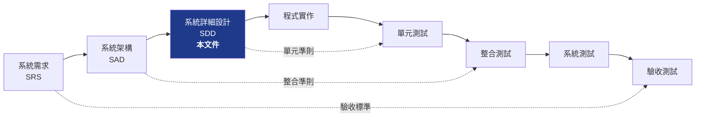
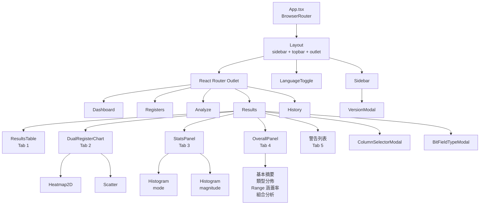
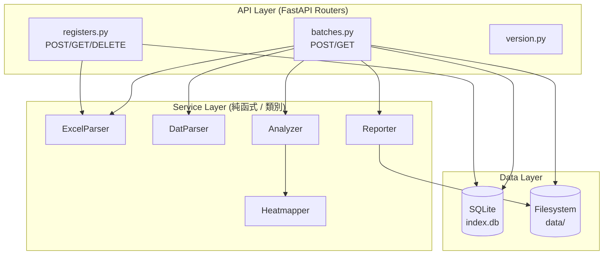

# FPGA Register Analyzer — 系統詳細設計

> 版本：v0.4.0　|　[← 回索引](index.md)　|　（首份）　·　[下一份：資料模型與介面 →](02-data-and-interfaces.md)

本份內容簡述：1-2 章，引言與元件分解。涵蓋 V-Model 階層位置、與架構文件的關係、前端 React 元件樹、前端目錄結構與後端服務分層。

---

## 1. 引言

### 1.1 V-Model 階層位置

本系統採用 V-Model 軟體開發方法，文件由抽象往具體層層展開：



### 1.2 與 architecture.md 的關係

| 文件 | 關注點 | 範例內容 |
| --- | --- | --- |
| `architecture.md`（簡略版） | What & Why | 為何選 SQLite、整體圖、API endpoint 列表 |
| `detailed-design.md`（本文件） | How | 元件 props 介面、bit-field 解析偽程式碼、API 完整 request/response schema、序列圖 |

詳細設計**不重複**架構文件已涵蓋的高階決策，而是**展開**那些決策的執行細節。

### 1.3 本文件範圍

- **前端**：React 元件分層、props 介面、UI 狀態機、客戶端資料流
- **後端**：FastAPI 服務分層、Pydantic 模型、SQLAlchemy ORM、API contract（**規劃中**，尚未實作）
- **演算法**：Bit-field 解析、組合分析、Range 涵蓋率、Histogram 分箱
- **跨層流程**：序列圖（上傳 / 分析 / 查詢 / 下載）、資料流圖、錯誤處理流程

**不包含**：部署、CI/CD、單元測試實作（屬於下一階段）。

---

## 2. 元件分解 (Component Decomposition)

### 2.1 前端 React 元件樹



### 2.2 前端目錄結構（實作後）

```
frontend/src/
├── App.tsx                      # 路由根
├── main.tsx                     # entry
├── i18n/
│   ├── index.ts                 # react-i18next 配置
│   ├── zh-TW.json
│   └── en.json
├── hooks/
│   └── useBitFieldTypes.ts      # localStorage 包裝
├── mock/
│   └── data.ts                  # 開發用 mock 資料
├── styles/
│   └── global.css               # 共用樣式
├── components/
│   ├── Layout.tsx
│   ├── Sidebar.tsx
│   ├── LanguageToggle.tsx
│   ├── VersionModal.tsx
│   ├── charts/
│   │   ├── Heatmap2D.tsx        # 兩 register 2D 熱力圖
│   │   ├── Scatter.tsx          # 兩 register 散佈圖
│   │   └── Histogram.tsx        # 直方圖
│   └── results/
│       ├── ResultsTable.tsx
│       ├── DualRegisterChart.tsx
│       ├── StatsPanel.tsx
│       ├── OverallPanel.tsx
│       ├── ColumnSelectorModal.tsx
│       └── BitFieldTypeModal.tsx
└── pages/
    ├── Dashboard.tsx
    ├── Registers.tsx
    ├── Analyze.tsx
    ├── Results.tsx              # 容器：Tab 切換 + 共用 state
    └── History.tsx
```

### 2.3 後端服務分層（規劃中）



每層的責任：
- **API Layer**：HTTP 路由、請求驗證、回應序列化、錯誤包裝
- **Service Layer**：業務邏輯，純 Python，無 FastAPI / HTTP 知識
- **Data Layer**：SQLAlchemy ORM 對 SQLite；檔案系統路徑管理

---

> 導覽：（首份）　|　[索引](index.md)　|　[下一份：資料模型與介面 →](02-data-and-interfaces.md)
