# FPGA Register Analyzer — 系統詳細設計

> 版本：v0.44　|　日期：2026-06-25　|　開發者：Aaron Hsueh　|　[← 回索引](index.md)　|　[← 上一份：資料模型與介面](02-data-and-interfaces.md)　·　[下一份：演算法 →](04-algorithms.md)

本份內容簡述：5-7 章，動態行為。涵蓋 6 個序列圖、6 個資料流圖與 4 個狀態圖。

---

## 5. 序列圖 (Sequence Diagrams)

### 5.1 SD-1：使用者上傳 Register Excel

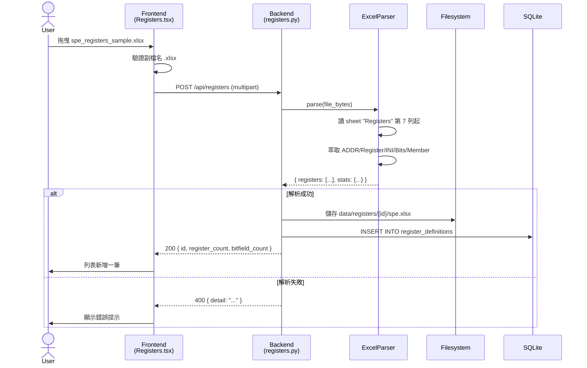

### 5.2 SD-2：上傳 N 個 dat 並執行分析

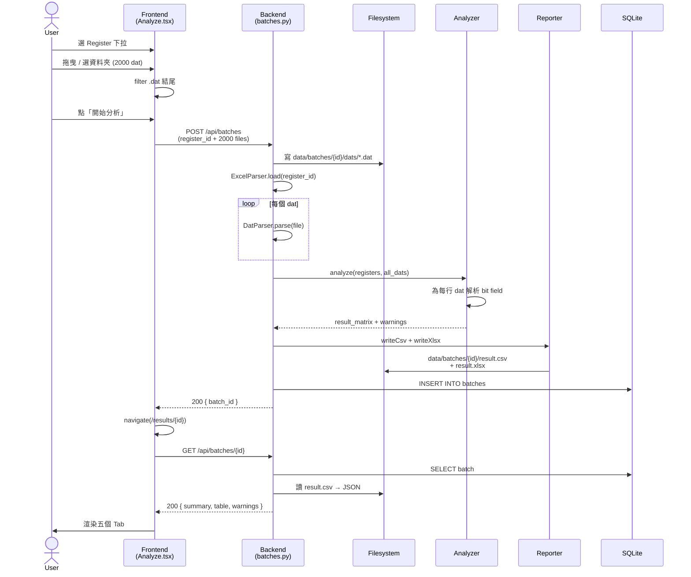

### 5.3 SD-3：切換 Bit Field 類型（純前端，localStorage）

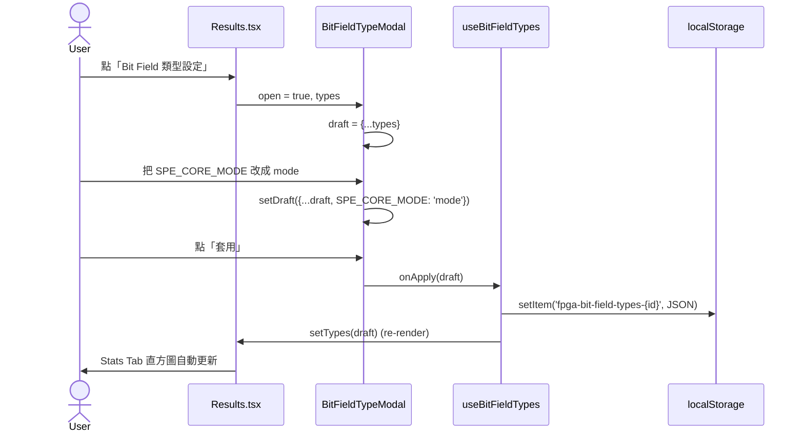

### 5.4 SD-4：下載 CSV / Excel

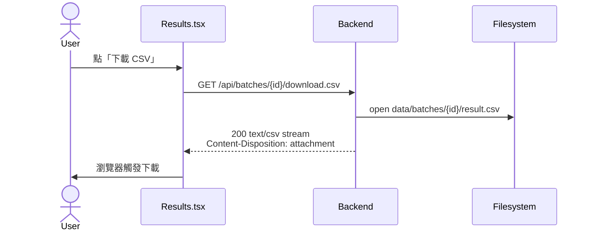

### 5.5 SD-5：查詢歷史 batch

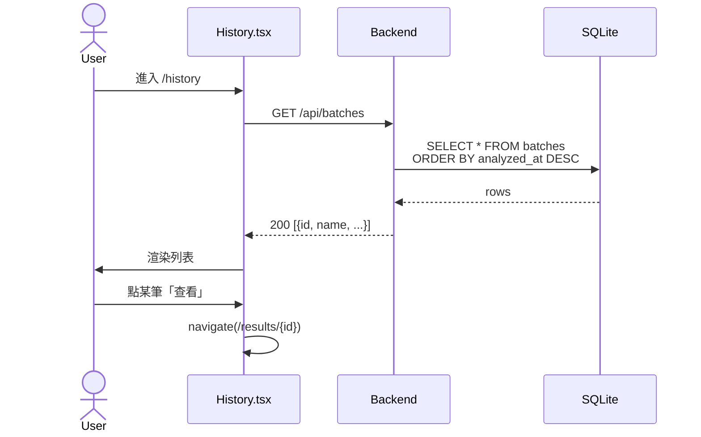

### 5.6 SD-6：Results 頁 Tab 切換（純前端內部）

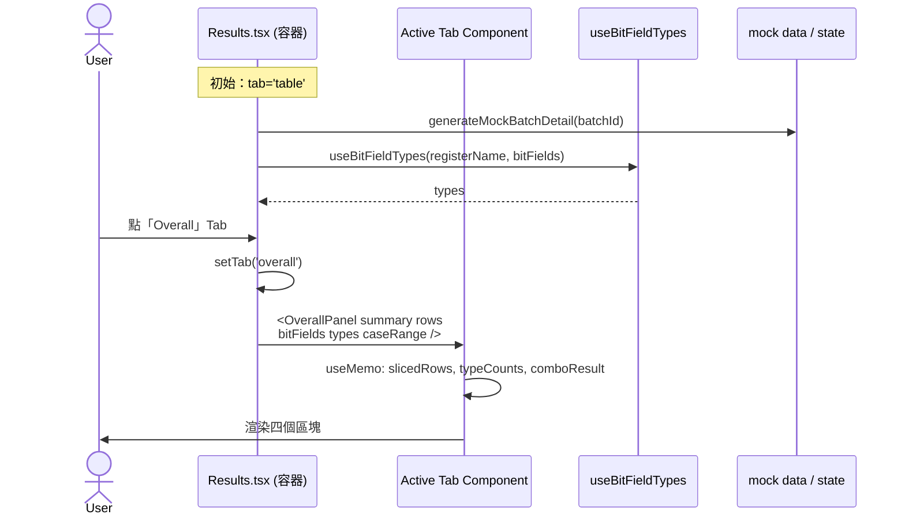

---

## 6. 資料流圖 (Data Flow Diagrams)

### 6.1 DF-1：Excel → Registers Dictionary

```mermaid
graph LR
    A[Excel .xlsx<br/>spe_registers_sample.xlsx] --> B[openpyxl<br/>load_workbook]
    B --> C[Sheet 'Registers'<br/>第 7 列起]
    C --> D[ExcelParser<br/>逐列掃描]
    D --> E[delimiter check:<br/>ADDR+Register<br/>非空則新 register]
    E --> F[Bits parser<br/>'5_4' → 5,4<br/>'10' → 10,10]
    F --> G[Registers Dict<br/>{addr: {<br/>  name,<br/>  bitfields[]<br/>}}]
    G --> H[(快取於 RAM)]
```

### 6.2 DF-2：dat → AddressValuePairs

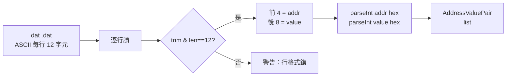

### 6.3 DF-3：Registers + Dat → Result Matrix（核心）

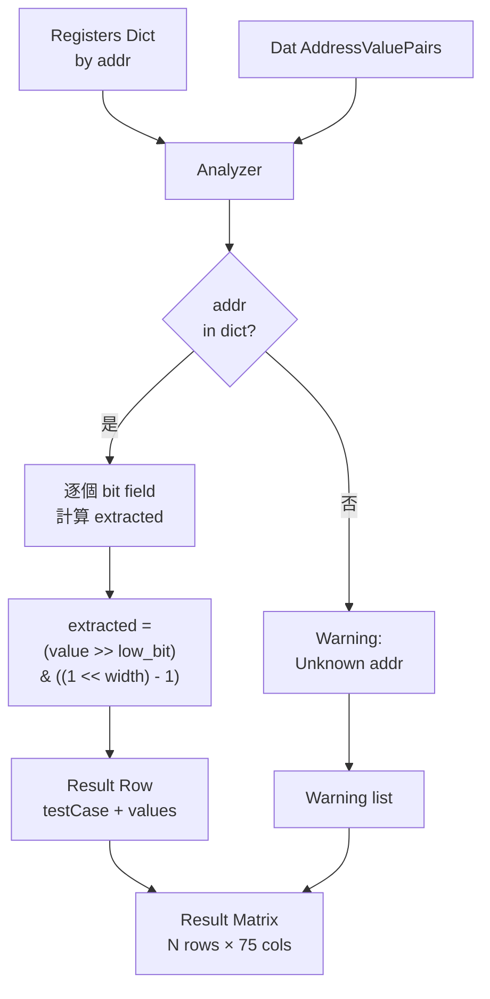

### 6.4 DF-4：Result Matrix → 輸出

```mermaid
graph LR
    A[Result Matrix<br/>in RAM] --> R{Reporter}
    R --> CSV[csv.writer<br/>每行 = testCase + values]
    R --> XLSX[openpyxl<br/>同欄位寫入]
    CSV --> F1[data/batches/{id}/result.csv]
    XLSX --> F2[data/batches/{id}/result.xlsx]

    A --> J[JSON 序列化<br/>給前端]
    J --> API[REST 回應]
```

### 6.5 DF-5：後端 JSON → 前端 UI 元件

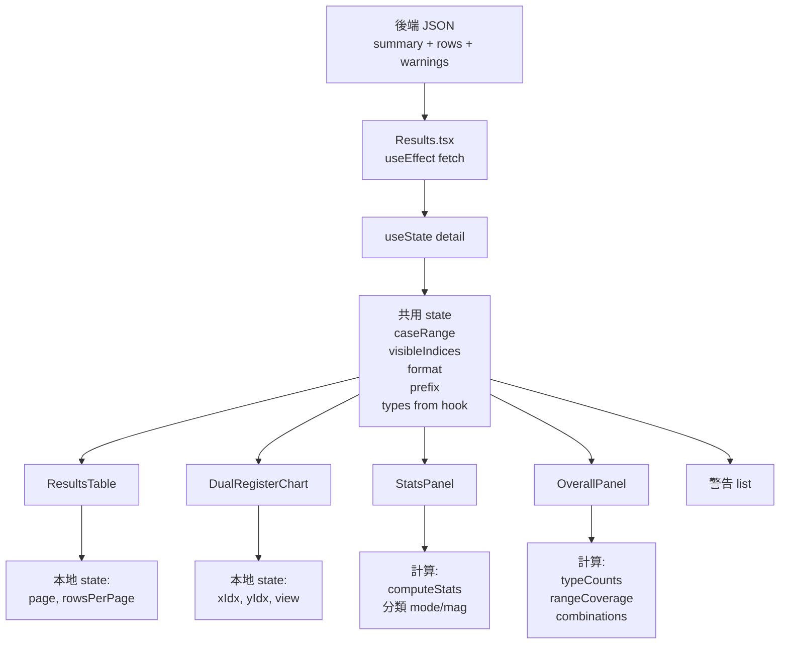

### 6.6 DF-6：數值解讀格式 (ValueFormat) 資料流（v0.44）

> 後端永遠儲存 unsigned 原始整數；`FieldRange.format`（`uint` / `sint` / `fp32`，存於 rangeMap → localStorage，每個 register 一份）只改變**前端怎麼解讀**這個原始值。共用 helper `interpretValue(raw, width, format)` 與 `formatBounds(width, format)` 定義於 `useBitFieldTypes.ts`。注意：主資料表儲存格與 2D 熱力圖／散佈圖**不**經過解讀，維持顯示原始 unsigned 值。

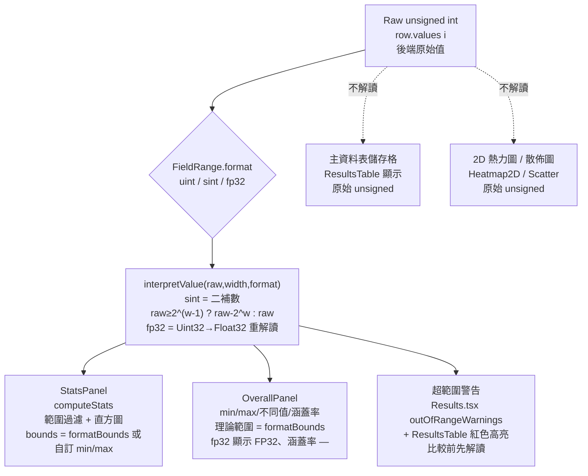

---

## 7. 狀態圖 (State Diagrams)

### 7.1 ST-1：Analyze 頁三步驟狀態機

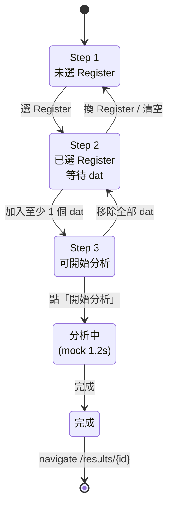

### 7.2 ST-2：分析批次 Lifecycle（後端）

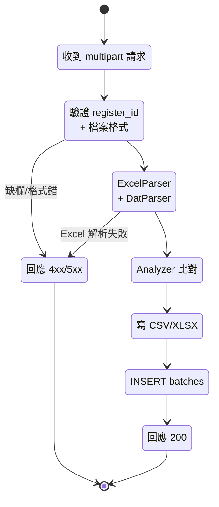

### 7.3 ST-3：Bit Field 類型

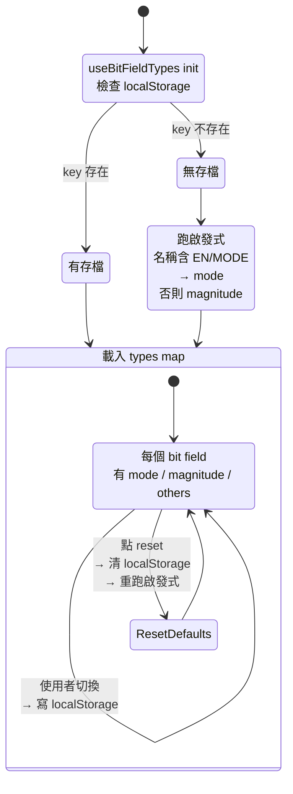

### 7.4 ST-4：Results 頁 Tab

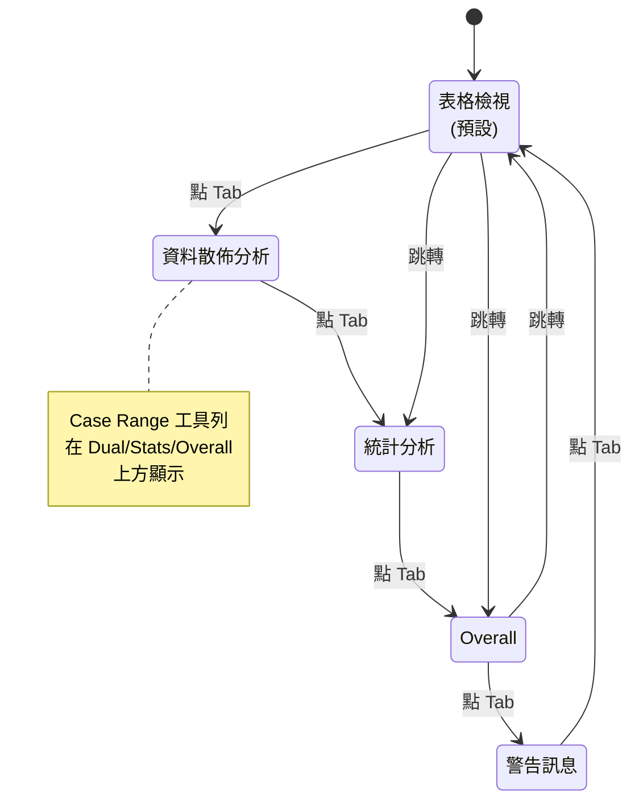

---

> 導覽：[← 上一份：資料模型與介面](02-data-and-interfaces.md)　|　[索引](index.md)　|　[下一份：演算法 →](04-algorithms.md)
